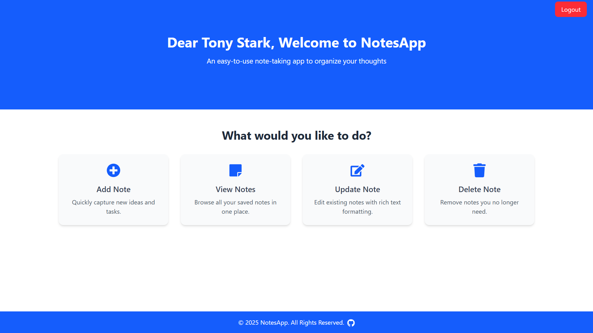
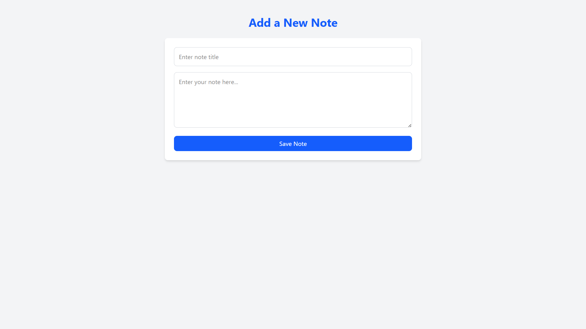
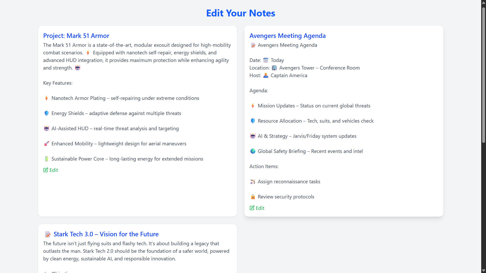
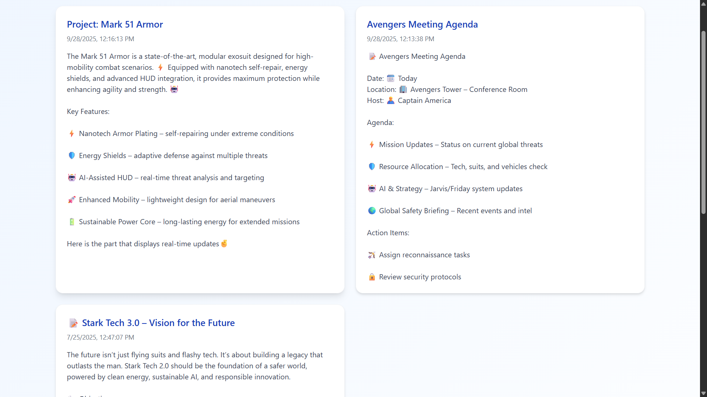

# 📝 Notes App (notezen)

A full-stack notes application where users can create, edit, and delete notes. Built with modern technologies including **React**, **Vite**, **Tailwind CSS**, **Express.js**, and **MongoDB Atlas**.

---

## 🔗 Live Links

- 🌐 Live App: [Click here](http://notezen.netlify.app/)
- ⚙️ Backend Repo: [Click here](https://github.com/YashwantBhole/react-notes-app-backend)

---
 
## 🌟 Features

- ✅ Create, Read, Update, Delete (CRUD) notes
- ⚡ Real-Time Updates: Changes are reflected instantly
- 🧠 Large and rich note content support
- 📦 MongoDB Atlas database
- ⚡ Fast UI with Vite and Tailwind CSS
- 📱 Fully responsive design
- ☁️ Live deployed frontend and backend

---

## 🖥️ Demo Screenshots

**1️⃣ Dashboard/Home Page**  

**2️⃣ Add Note**  

**3️⃣ Edit Note**  

**4️⃣ Real-Time Updates**  

---

## 🛠️ Tech Stack

### 🚀 Frontend:
- [React](https://reactjs.org/) - Interactive UI components
- [Vite](https://vitejs.dev/) – blazing fast build tool
- [Tailwind CSS](https://tailwindcss.com/) – utility-first CSS    
- [Axios](https://axios-http.com/) – for HTTP requests
- [Netlify](https://netlify.com/) – for deployment

### 🛠️ Backend:
- [Node.js](https://nodejs.org/) - Server-side logic
- [Express.js](https://expressjs.com/) - Backend Server
- [MongoDB Atlas](https://www.mongodb.com/cloud/atlas) - Cloud database for real-time storage
- [Mongoose](https://mongoosejs.com/) - Elegant MongoDB object modeling
- [Render](https://render.com/) – for backend hosting
- [dotenv](https://www.npmjs.com/package/dotenv) – to manage environment variables
- [CORS](https://www.npmjs.com/package/cors) – to allow frontend-backend communication

---

## 🔧 Getting Started Locally

### 1. Clone the Repository
       git clone https://github.com/your-username/notes-app.git
       cd notes-app

###  2. Setup the Backend
      cd server
      npm install
- Create a .env file with:
- MONGODB_URI = your-mongo-uri
- PORT = 5000
- npm start
    
### Setup the Frontend
      cd client
      npm install
      npm run dev
---

## 👤 Author & Connect With Me

### **Yashwant Bhole**

  
  
  
  

💼 *Full Stack Developer — MERN • Java • Spring Boot*  
🌟 *Building AI-powered systems with clean architecture and strong UI/UX.*

---

## ⭐ Feedback

If you found this project helpful, please ⭐ **star** the repository — it encourages me a lot!
